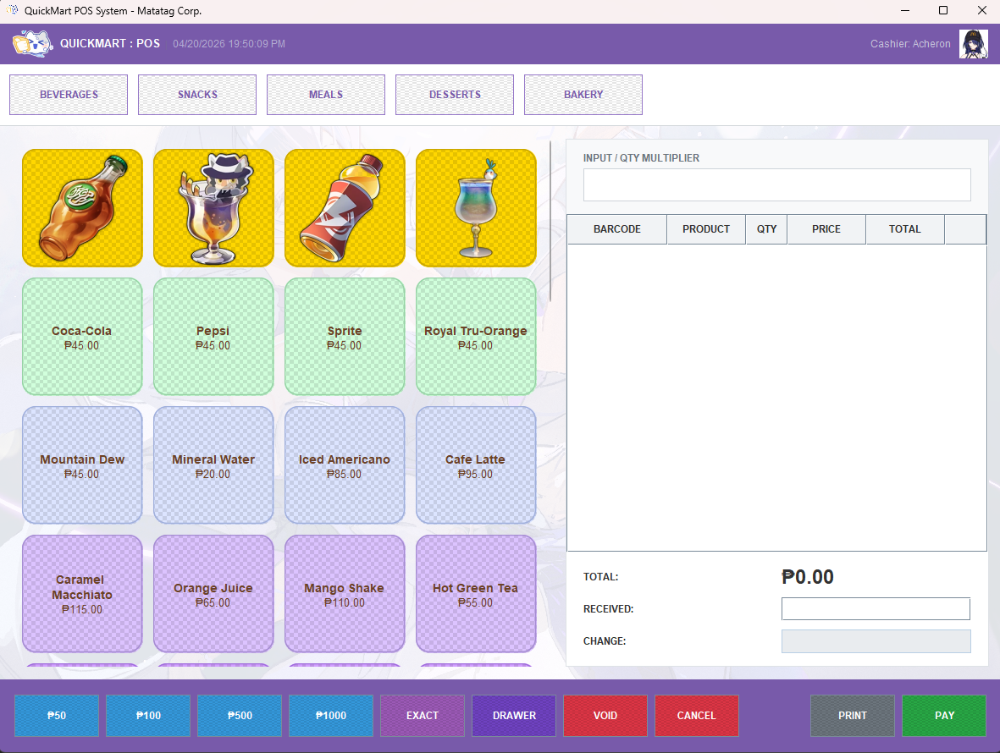
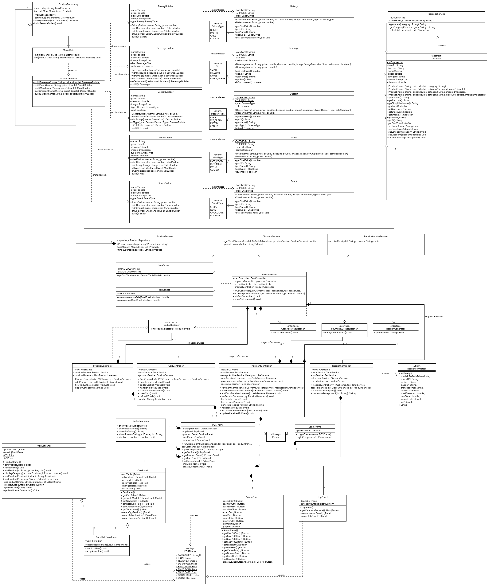

# QuickMart PoS System

Sample POS terminal built with Java Swing.

## Preview

## Screenshot

## UML Diagram

## Key Features

- Secure login (operator authentication)
- Void item / clear cart controls
- Fast input (amount + quantity buttons)
- HTML/CSS receipt rendering via `JEditorPane`
- Persistent transaction logging
- Modular architecture (model / gui / theme / controller)
- Custom themed UI (HSR-inspired)

## Configuration Details
To avoid `NullPointerException` errors, you **must** mark the directory containing your images and icons as the **Resources Folder** in your IDE.
- If this is not done, the app will crash on startup because it cannot find the assets.

## Login 
NOTE: Hard-coded credentials. It can be decoupled and put in a UserRepository class, but the intended scope of the project is small
- **User:** acheron
- **Pass:** hsr1234

## Author's Note
- Development time, 2 days

- I always wanted to create a POS system. It was fun going over JavaSwing's libraries, but I find the lack of support for modern styling pretty saddening.
It was verbose as is, always trying to override and extend components.
I won't be extending this any further, but will probably drop either a .jar or .exe file for download though

---

Disclaimer: This project is a non-commercial, fan-made application and is not affiliated with or endorsed by HoYoverse (miHoYo). All game-related assets and trademarks are the property of their respective owners. These assets are used strictly for demonstrative purposes to showcase UI/UX implementation and resource-handling capabilities.
